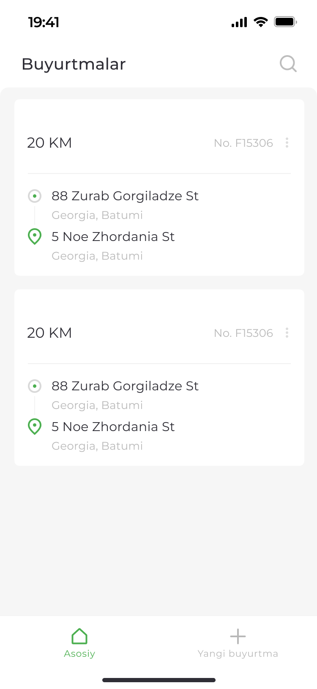
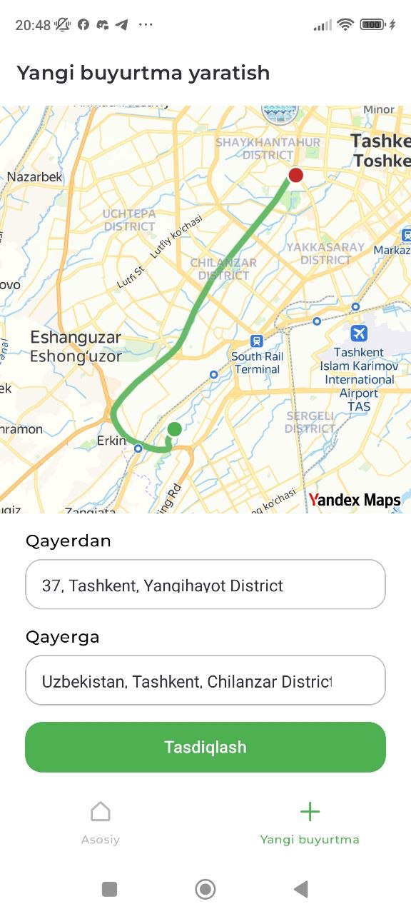
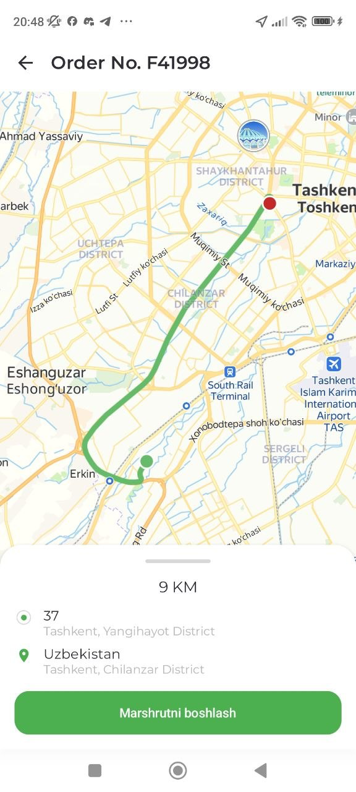

# BTS Task

Android buyurtmalarni boshqarish ilovasi. Yandex MapKit yordamida xaritada manzillarni belgilash, marshrutni chizish va masofani hisoblash imkonini beradi.

## Imkoniyatlar

- **Buyurtmalar ro'yxati** — barcha buyurtmalarni masofa, raqam va manzillar bilan ko'rsatadi. Foydalanuvchining joylashuvigacha bo'lgan masofa avtomatik hisoblanadi.
- **Qidiruv** — buyurtmani raqami bo'yicha real vaqtda filtrlash.
- **Yangi buyurtma yaratish** — xaritadan ikki nuqtani (olib ketish va manzil) tanlash, reverse geocoding orqali manzillarni avtomatik aniqlash, marshrutni Yandex Directions API orqali chizish.
- **Buyurtma tafsilotlari** — to'liq xaritali ko'rinish, marshrut chiziqlari, manzillar va masofa.
- **O'chirish** — tasdiqlash dialogi bilan buyurtmani xavfsiz olib tashlash.
- **Lokatsiya ruxsati** — Accompanist Permissions orqali boshqariladi.
- **Shimmer loading** — ma'lumot yuklanayotganda silliq skeleton animatsiya.

## Texnologiyalar

| Qatlam | Stack |
|--------|-------|
| Til | Kotlin 2.2.10 |
| UI | Jetpack Compose, Material 3 |
| Arxitektura | Clean Architecture (data / domain / presentation), MVVM |
| Navigatsiya | Navigation Compose (type-safe routes) |
| DI | Koin |
| Ma'lumotlar bazasi | Room |
| Asinxron | Kotlin Coroutines + Flow |
| Xarita | Yandex MapKit 4.6.1 (Directions, Geocoding) |
| minSdk / targetSdk | 24 / 36 |

## Loyiha tuzilmasi

```
app/src/main/java/com/example/bts_task/
├── data/           # Room, repository, geocoder, location provider
├── domain/         # Model, repository interfaces, use case'lar
├── di/             # Koin modullari (Data, Domain, Presentation)
├── presentation/   # Compose ekranlar va ViewModel'lar
│   ├── orders/         # Buyurtmalar ro'yxati
│   ├── new_order/      # Yangi buyurtma
│   ├── order_detail/   # Buyurtma tafsilotlari
│   └── common/         # YandexMapView, BitmapHelper
└── ui/theme/       # Ranglar, tipografiya, mavzu
```

## Skrinshotlar

| Buyurtmalar | Yangi buyurtma | Tafsilotlar |
|-------------|----------------|-------------|
|  |  |  |

## O'rnatish

### Talablar

- Android Studio (Giraffe yoki yangiroq)
- JDK 11+
- Yandex MapKit API kaliti — [developer.tech.yandex.ru](https://developer.tech.yandex.ru/) saytidan oling

### Qadamlar

1. Repository'ni klonlash:
   ```bash
   git clone https://github.com/<username>/btstask.git
   cd btstask
   ```

2. API kalitni `gradle.properties` faylga qo'shing:
   ```properties
   YANDEX_MAPKIT_API_KEY=sizning_kalitingiz
   ```

3. Loyihani Android Studio'da oching va sync qiling.

4. Ilovani ishga tushiring:
   ```bash
   ./gradlew installDebug
   ```

## Ruxsatlar

- `INTERNET`, `ACCESS_NETWORK_STATE` — xarita va geocoder so'rovlari uchun
- `ACCESS_FINE_LOCATION`, `ACCESS_COARSE_LOCATION` — foydalanuvchi joylashuvigacha bo'lgan masofani hisoblash uchun

## Seed data

Birinchi ishga tushirishda baza Toshkent, Samarqand, Buxoro shaharlaridagi 3 ta namuna buyurtma bilan to'ldiriladi.
